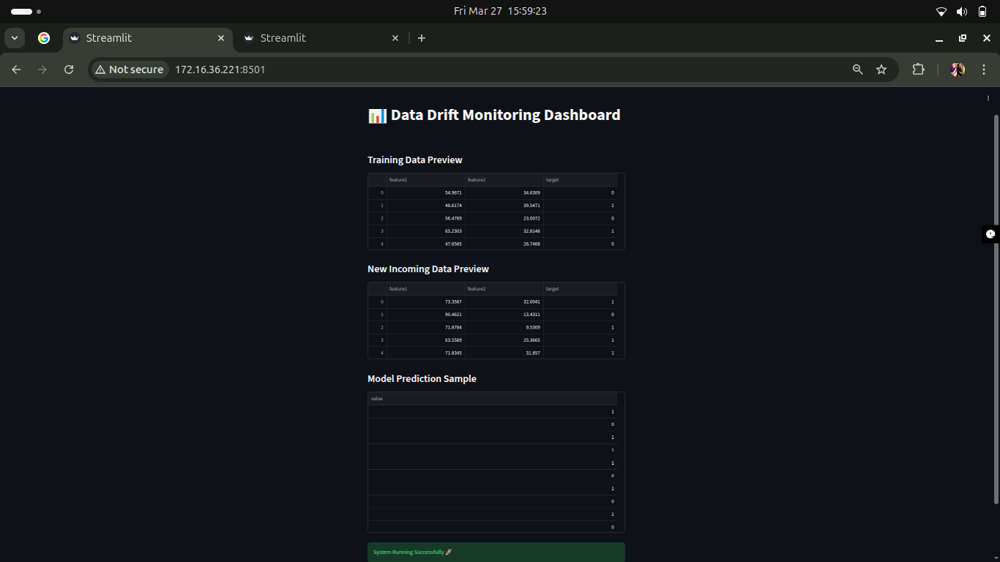

# 🚀 Data Drift Detection & Automated Retraining System

## 👩‍💻 Author

**Aishwarya Priydarshni**
🎓 Final Year B.Tech (CSE - Data Science)
💡 Aspiring Machine Learning Engineer

* 🔗 GitHub: https://github.com/Aishwaryap015
* 🔗 LinkedIn: https://www.linkedin.com/in/aishwarya-priydarshni
---

## 📌 Overview

Machine Learning models degrade over time due to **data drift** — when real-world data changes and no longer matches the training distribution.

This project implements a **production-style ML monitoring system** that:

* Detects data drift using statistical methods
* Evaluates model performance
* Automatically retrains the model when necessary
* Logs system activity
* Provides a **Streamlit dashboard for visualization**

---

## 🎯 Problem Statement

In real-world applications (finance, healthcare, e-commerce), models must continuously adapt to changing data.

This system simulates that pipeline by:

✔ Monitoring incoming data
✔ Detecting distribution shifts
✔ Making retraining decisions
✔ Maintaining model accuracy

---

## 🧠 Key Features

* 📊 **Data Drift Detection (KS Test)**
* 🔁 **Automated Retraining Pipeline**
* 📈 **Accuracy Comparison (Before vs After Retrain)**
* 📝 **Logging System (Production-style tracking)**
* 🌐 **Interactive Streamlit Dashboard**
* 📁 Modular & Scalable Code Structure

---

## 🏗️ System Architecture

```text
Train Model → Monitor New Data → Detect Drift →
Evaluate Performance → Retrain Model → Log Results
```

---

## 📂 Project Structure

```text
data-drift-system/
│
├── data/                  # Training & incoming data
├── models/                # Saved ML models
├── reports/               # Drift reports & logs
│   ├── drift_report.html
│   └── log.txt
│
├── screenshots/           # Dashboard screenshots
│   ├── local_dashboard.png
│   └── network_dashboard.png
│
├── src/                   # Core ML pipeline modules
│   ├── train.py
│   ├── detect_drift.py
│   ├── retrain.py
│   ├── evaluate.py
│   ├── logger.py
│
├── app.py                 # Streamlit dashboard
├── main.py                # Pipeline execution
├── generate_data.py       # Synthetic data generator
├── requirements.txt
└── README.md
```

---

## ⚙️ Tech Stack

* **Python**
* **Pandas, NumPy**
* **Scikit-learn**
* **Evidently**
* **Streamlit**
* **SciPy (KS Test)**

---

## ▶️ How to Run

### 1️⃣ Install Dependencies

```bash
pip install -r requirements.txt
```

### 2️⃣ Generate Data

```bash
python generate_data.py
```

### 3️⃣ Run ML Pipeline

```bash
python main.py
```

### 4️⃣ Launch Dashboard

```bash
streamlit run app.py
```

---

## 📊 Streamlit Dashboard

After running the dashboard:

```text
Local URL: http://localhost:8501  
Network URL: http://172.16.36.221:8501  
```

### 🖥️ Local Dashboard View



### 🌐 Network Dashboard View


---

## 📈 Output Generated

* 📄 Drift Report → `reports/drift_report.html`
* 📝 Logs → `reports/log.txt`
* 🤖 Trained Model → `models/model.pkl`

---

## 🧪 Drift Detection Logic

* Uses **Kolmogorov–Smirnov (KS) Test**
* Calculates drift for each feature
* Computes **drift ratio**
* Triggers retraining when drift exceeds threshold

---

## 💡 Future Improvements

* 🔄 Real-time streaming (Kafka integration)
* ☁️ Cloud deployment (AWS / GCP)
* 📊 Advanced dashboard with analytics
* 🔁 CI/CD pipeline for automation

---

## ⭐ Key Highlights

* Built a **real-world ML monitoring system**
* Implemented **statistical drift detection**
* Designed **automated retraining pipeline**
* Integrated **dashboard + logging system**

---

## 🎤 Interview Explanation

> “I developed an end-to-end ML monitoring system that detects data drift using statistical tests (KS Test), evaluates model performance, and triggers automated retraining, along with a Streamlit dashboard for real-time visualization.”

---

## 📌 Conclusion

This project demonstrates practical implementation of **ML lifecycle management**, making it highly relevant for roles in:

* Machine Learning Engineering
* Data Science
* MLOps

---

## 📜 License

This project is for educational and demonstration purposes.
